#         `CSE-587`| ****Home work -**** ***`1`*** | ****`DIC`**** 
---
---

  #### **Author :** ***`Taran Mamidala`*** 

<hr>

## Task Breakdown

### a. Loading the Data
1. **(5 pt)** Load the data into the DataFrame using the URL. *You lose points if reading from a local folder.*

### b. Initial Exploratory and Visualization
1. **(5 pt)** Print the metadata of column information.
2. **(10 pt)** What is the total number of crimes committed according to the description of the crime code? 
   - Make a visualization using just one graph that shows a distribution of several crimes.
3. **(10 pt)** Make a visualization to suggest the highest crime-prone areas. 
   - You may plot multiple graphs.
4. **(10 pt)** Make a visualization to warn the general public about the trend of crimes according to:
   - Time of crime occurrence,
   - Sex and age of the victim, 
   - The area in which it can occur.
   - You may plot multiple graphs.

### c. Investigating Patterns of Vehicle Thefts in Los Angeles
1. **(10 pt)** Apply conditions to make it a valid problem statement.
   - Also, provide features which you think are important according to your problem statement.
2. **(10 pt)** Explain your approach to your problem statement.
3. **(10 pt)** Perform data cleaning to get the pure data for this problem.
   - Explain your data cleaning steps. (*At least 3 cleaning steps*).
4. **(10 pt)** Implement your approach to this problem and justify your hypothesis.

### d. Exploring Identity Theft Cases in Los Angeles
1. **(10 pt)** Explain your approach to this problem.
   - Also, provide features which you think are important according to your problem statement.
2. **(10 pt)** Perform data cleaning to get the pure data for this problem.
   - Explain your data cleaning steps.


```python
!pip install matplotlib
```

    Defaulting to user installation because normal site-packages is not writeable
    Requirement already satisfied: matplotlib in c:\users\mamid\appdata\roaming\python\python312\site-packages (3.9.2)
    Requirement already satisfied: contourpy>=1.0.1 in c:\users\mamid\appdata\roaming\python\python312\site-packages (from matplotlib) (1.3.0)
    Requirement already satisfied: cycler>=0.10 in c:\users\mamid\appdata\roaming\python\python312\site-packages (from matplotlib) (0.12.1)
    Requirement already satisfied: fonttools>=4.22.0 in c:\users\mamid\appdata\roaming\python\python312\site-packages (from matplotlib) (4.53.1)
    Requirement already satisfied: kiwisolver>=1.3.1 in c:\users\mamid\appdata\roaming\python\python312\site-packages (from matplotlib) (1.4.7)
    Requirement already satisfied: numpy>=1.23 in c:\program files\python312\lib\site-packages (from matplotlib) (2.1.0)
    Requirement already satisfied: packaging>=20.0 in c:\users\mamid\appdata\roaming\python\python312\site-packages (from matplotlib) (24.1)
    Requirement already satisfied: pillow>=8 in c:\users\mamid\appdata\roaming\python\python312\site-packages (from matplotlib) (10.4.0)
    Requirement already satisfied: pyparsing>=2.3.1 in c:\users\mamid\appdata\roaming\python\python312\site-packages (from matplotlib) (3.1.4)
    Requirement already satisfied: python-dateutil>=2.7 in c:\users\mamid\appdata\roaming\python\python312\site-packages (from matplotlib) (2.9.0.post0)
    Requirement already satisfied: six>=1.5 in c:\users\mamid\appdata\roaming\python\python312\site-packages (from python-dateutil>=2.7->matplotlib) (1.16.0)
    


```python
# Imported necessary libraries
import pandas as pd
import numpy as np
import matplotlib as mpl
import matplotlib.pyplot as plt
%matplotlib inline
```

a. (5 pt) Load the data into the DataFrame using the URL. (You loose points if reading from
local folder)


```python

df = pd.read_csv("https://data.lacity.org/api/views/2nrs-mtv8/rows.csv?accessType=DOWNLOAD")

```


```python
# df = pd.read_csv("https://data.lacity.org/resource/2nrs-mtv8.csv")
```

### **b. Initial Exploratory and visualization:** 
- (5 pt) Print the metadata of column information.
- (10 pts) What is the total number of crimes committed according to the description
of the crime code? Make a visualization using just one graph that shows a
distribution of several crimes. 
- (10pts) Make a visualization to suggest highest crime prone areas. You may plot
multiple graphs.
- (10pts) Make a visualization to warn general public about the trend crimes
according to the time of crime occurence, sex and age of victim and the area in
which it can occur. You may plot multiple graphs.


```python
df
```


<div>
<style scoped>
    .dataframe tbody tr th:only-of-type {
        vertical-align: middle;
    }

    .dataframe tbody tr th {
        vertical-align: top;
    }

    .dataframe thead th {
        text-align: right;
    }
</style>
<table border="1" class="dataframe">
  <thead>
    <tr style="text-align: right;">
      <th></th>
      <th>DR_NO</th>
      <th>Date Rptd</th>
      <th>DATE OCC</th>
      <th>TIME OCC</th>
      <th>AREA</th>
      <th>AREA NAME</th>
      <th>Rpt Dist No</th>
      <th>Part 1-2</th>
      <th>Crm Cd</th>
      <th>Crm Cd Desc</th>
      <th>...</th>
      <th>Status</th>
      <th>Status Desc</th>
      <th>Crm Cd 1</th>
      <th>Crm Cd 2</th>
      <th>Crm Cd 3</th>
      <th>Crm Cd 4</th>
      <th>LOCATION</th>
      <th>Cross Street</th>
      <th>LAT</th>
      <th>LON</th>
    </tr>
  </thead>
  <tbody>
    <tr>
      <th>0</th>
      <td>190326475</td>
      <td>03/01/2020 12:00:00 AM</td>
      <td>03/01/2020 12:00:00 AM</td>
      <td>2130</td>
      <td>7</td>
      <td>Wilshire</td>
      <td>784</td>
      <td>1</td>
      <td>510</td>
      <td>VEHICLE - STOLEN</td>
      <td>...</td>
      <td>AA</td>
      <td>Adult Arrest</td>
      <td>510.0</td>
      <td>998.0</td>
      <td>NaN</td>
      <td>NaN</td>
      <td>1900 S  LONGWOOD                     AV</td>
      <td>NaN</td>
      <td>34.0375</td>
      <td>-118.3506</td>
    </tr>
    <tr>
      <th>1</th>
      <td>200106753</td>
      <td>02/09/2020 12:00:00 AM</td>
      <td>02/08/2020 12:00:00 AM</td>
      <td>1800</td>
      <td>1</td>
      <td>Central</td>
      <td>182</td>
      <td>1</td>
      <td>330</td>
      <td>BURGLARY FROM VEHICLE</td>
      <td>...</td>
      <td>IC</td>
      <td>Invest Cont</td>
      <td>330.0</td>
      <td>998.0</td>
      <td>NaN</td>
      <td>NaN</td>
      <td>1000 S  FLOWER                       ST</td>
      <td>NaN</td>
      <td>34.0444</td>
      <td>-118.2628</td>
    </tr>
    <tr>
      <th>2</th>
      <td>200320258</td>
      <td>11/11/2020 12:00:00 AM</td>
      <td>11/04/2020 12:00:00 AM</td>
      <td>1700</td>
      <td>3</td>
      <td>Southwest</td>
      <td>356</td>
      <td>1</td>
      <td>480</td>
      <td>BIKE - STOLEN</td>
      <td>...</td>
      <td>IC</td>
      <td>Invest Cont</td>
      <td>480.0</td>
      <td>NaN</td>
      <td>NaN</td>
      <td>NaN</td>
      <td>1400 W  37TH                         ST</td>
      <td>NaN</td>
      <td>34.0210</td>
      <td>-118.3002</td>
    </tr>
    <tr>
      <th>3</th>
      <td>200907217</td>
      <td>05/10/2023 12:00:00 AM</td>
      <td>03/10/2020 12:00:00 AM</td>
      <td>2037</td>
      <td>9</td>
      <td>Van Nuys</td>
      <td>964</td>
      <td>1</td>
      <td>343</td>
      <td>SHOPLIFTING-GRAND THEFT ($950.01 &amp; OVER)</td>
      <td>...</td>
      <td>IC</td>
      <td>Invest Cont</td>
      <td>343.0</td>
      <td>NaN</td>
      <td>NaN</td>
      <td>NaN</td>
      <td>14000    RIVERSIDE                    DR</td>
      <td>NaN</td>
      <td>34.1576</td>
      <td>-118.4387</td>
    </tr>
    <tr>
      <th>4</th>
      <td>220614831</td>
      <td>08/18/2022 12:00:00 AM</td>
      <td>08/17/2020 12:00:00 AM</td>
      <td>1200</td>
      <td>6</td>
      <td>Hollywood</td>
      <td>666</td>
      <td>2</td>
      <td>354</td>
      <td>THEFT OF IDENTITY</td>
      <td>...</td>
      <td>IC</td>
      <td>Invest Cont</td>
      <td>354.0</td>
      <td>NaN</td>
      <td>NaN</td>
      <td>NaN</td>
      <td>1900    TRANSIENT</td>
      <td>NaN</td>
      <td>34.0944</td>
      <td>-118.3277</td>
    </tr>
    <tr>
      <th>...</th>
      <td>...</td>
      <td>...</td>
      <td>...</td>
      <td>...</td>
      <td>...</td>
      <td>...</td>
      <td>...</td>
      <td>...</td>
      <td>...</td>
      <td>...</td>
      <td>...</td>
      <td>...</td>
      <td>...</td>
      <td>...</td>
      <td>...</td>
      <td>...</td>
      <td>...</td>
      <td>...</td>
      <td>...</td>
      <td>...</td>
      <td>...</td>
    </tr>
    <tr>
      <th>978623</th>
      <td>240710284</td>
      <td>07/24/2024 12:00:00 AM</td>
      <td>07/23/2024 12:00:00 AM</td>
      <td>1400</td>
      <td>7</td>
      <td>Wilshire</td>
      <td>788</td>
      <td>1</td>
      <td>510</td>
      <td>VEHICLE - STOLEN</td>
      <td>...</td>
      <td>IC</td>
      <td>Invest Cont</td>
      <td>510.0</td>
      <td>NaN</td>
      <td>NaN</td>
      <td>NaN</td>
      <td>4000 W  23RD                         ST</td>
      <td>NaN</td>
      <td>34.0362</td>
      <td>-118.3284</td>
    </tr>
    <tr>
      <th>978624</th>
      <td>240104953</td>
      <td>01/15/2024 12:00:00 AM</td>
      <td>01/15/2024 12:00:00 AM</td>
      <td>100</td>
      <td>1</td>
      <td>Central</td>
      <td>101</td>
      <td>2</td>
      <td>745</td>
      <td>VANDALISM - MISDEAMEANOR ($399 OR UNDER)</td>
      <td>...</td>
      <td>IC</td>
      <td>Invest Cont</td>
      <td>745.0</td>
      <td>NaN</td>
      <td>NaN</td>
      <td>NaN</td>
      <td>1300 W  SUNSET                       BL</td>
      <td>NaN</td>
      <td>34.0685</td>
      <td>-118.2460</td>
    </tr>
    <tr>
      <th>978625</th>
      <td>241711348</td>
      <td>07/19/2024 12:00:00 AM</td>
      <td>07/19/2024 12:00:00 AM</td>
      <td>757</td>
      <td>17</td>
      <td>Devonshire</td>
      <td>1751</td>
      <td>2</td>
      <td>888</td>
      <td>TRESPASSING</td>
      <td>...</td>
      <td>IC</td>
      <td>Invest Cont</td>
      <td>888.0</td>
      <td>NaN</td>
      <td>NaN</td>
      <td>NaN</td>
      <td>10000    OLD DEPOT PLAZA              RD</td>
      <td>NaN</td>
      <td>34.2500</td>
      <td>-118.5990</td>
    </tr>
    <tr>
      <th>978626</th>
      <td>240309674</td>
      <td>04/24/2024 12:00:00 AM</td>
      <td>04/24/2024 12:00:00 AM</td>
      <td>1500</td>
      <td>3</td>
      <td>Southwest</td>
      <td>358</td>
      <td>1</td>
      <td>230</td>
      <td>ASSAULT WITH DEADLY WEAPON, AGGRAVATED ASSAULT</td>
      <td>...</td>
      <td>IC</td>
      <td>Invest Cont</td>
      <td>230.0</td>
      <td>NaN</td>
      <td>NaN</td>
      <td>NaN</td>
      <td>FLOWER                       ST</td>
      <td>JEFFERSON                    BL</td>
      <td>34.0215</td>
      <td>-118.2868</td>
    </tr>
    <tr>
      <th>978627</th>
      <td>240910892</td>
      <td>08/13/2024 12:00:00 AM</td>
      <td>08/12/2024 12:00:00 AM</td>
      <td>2300</td>
      <td>9</td>
      <td>Van Nuys</td>
      <td>914</td>
      <td>1</td>
      <td>510</td>
      <td>VEHICLE - STOLEN</td>
      <td>...</td>
      <td>IC</td>
      <td>Invest Cont</td>
      <td>510.0</td>
      <td>NaN</td>
      <td>NaN</td>
      <td>NaN</td>
      <td>6900    VESPER                       AV</td>
      <td>NaN</td>
      <td>34.1961</td>
      <td>-118.4510</td>
    </tr>
  </tbody>
</table>
<p>978628 rows × 28 columns</p>
</div>


```python
df.info()
```

    <class 'pandas.core.frame.DataFrame'>
    RangeIndex: 978628 entries, 0 to 978627
    Data columns (total 28 columns):
     #   Column          Non-Null Count   Dtype  
    ---  ------          --------------   -----  
     0   DR_NO           978628 non-null  int64  
     1   Date Rptd       978628 non-null  object 
     2   DATE OCC        978628 non-null  object 
     3   TIME OCC        978628 non-null  int64  
     4   AREA            978628 non-null  int64  
     5   AREA NAME       978628 non-null  object 
     6   Rpt Dist No     978628 non-null  int64  
     7   Part 1-2        978628 non-null  int64  
     8   Crm Cd          978628 non-null  int64  
     9   Crm Cd Desc     978628 non-null  object 
     10  Mocodes         834648 non-null  object 
     11  Vict Age        978628 non-null  int64  
     12  Vict Sex        841430 non-null  object 
     13  Vict Descent    841419 non-null  object 
     14  Premis Cd       978613 non-null  float64
     15  Premis Desc     978043 non-null  object 
     16  Weapon Used Cd  325959 non-null  float64
     17  Weapon Desc     325959 non-null  object 
     18  Status          978627 non-null  object 
     19  Status Desc     978628 non-null  object 
     20  Crm Cd 1        978617 non-null  float64
     21  Crm Cd 2        68816 non-null   float64
     22  Crm Cd 3        2309 non-null    float64
     23  Crm Cd 4        64 non-null      float64
     24  LOCATION        978628 non-null  object 
     25  Cross Street    151427 non-null  object 
     26  LAT             978628 non-null  float64
     27  LON             978628 non-null  float64
    dtypes: float64(8), int64(7), object(13)
    memory usage: 209.1+ MB
    


```python
df.describe()
```


<div>
<style scoped>
    .dataframe tbody tr th:only-of-type {
        vertical-align: middle;
    }

    .dataframe tbody tr th {
        vertical-align: top;
    }

    .dataframe thead th {
        text-align: right;
    }
</style>
<table border="1" class="dataframe">
  <thead>
    <tr style="text-align: right;">
      <th></th>
      <th>DR_NO</th>
      <th>TIME OCC</th>
      <th>AREA</th>
      <th>Rpt Dist No</th>
      <th>Part 1-2</th>
      <th>Crm Cd</th>
      <th>Vict Age</th>
      <th>Premis Cd</th>
      <th>Weapon Used Cd</th>
      <th>Crm Cd 1</th>
      <th>Crm Cd 2</th>
      <th>Crm Cd 3</th>
      <th>Crm Cd 4</th>
      <th>LAT</th>
      <th>LON</th>
    </tr>
  </thead>
  <tbody>
    <tr>
      <th>count</th>
      <td>9.786280e+05</td>
      <td>978628.000000</td>
      <td>978628.000000</td>
      <td>978628.000000</td>
      <td>978628.000000</td>
      <td>978628.000000</td>
      <td>978628.000000</td>
      <td>978613.000000</td>
      <td>325959.000000</td>
      <td>978617.000000</td>
      <td>68816.000000</td>
      <td>2309.000000</td>
      <td>64.00000</td>
      <td>978628.000000</td>
      <td>978628.000000</td>
    </tr>
    <tr>
      <th>mean</th>
      <td>2.196564e+08</td>
      <td>1338.802627</td>
      <td>10.702561</td>
      <td>1116.686084</td>
      <td>1.404785</td>
      <td>500.810635</td>
      <td>29.122904</td>
      <td>306.181502</td>
      <td>363.815372</td>
      <td>500.564847</td>
      <td>958.156344</td>
      <td>984.192724</td>
      <td>991.21875</td>
      <td>33.995399</td>
      <td>-118.081108</td>
    </tr>
    <tr>
      <th>std</th>
      <td>1.290395e+07</td>
      <td>651.622947</td>
      <td>6.107280</td>
      <td>610.836054</td>
      <td>0.490851</td>
      <td>206.309796</td>
      <td>21.961531</td>
      <td>218.908131</td>
      <td>123.673988</td>
      <td>206.107451</td>
      <td>110.251477</td>
      <td>51.506344</td>
      <td>27.06985</td>
      <td>1.640056</td>
      <td>5.684520</td>
    </tr>
    <tr>
      <th>min</th>
      <td>8.170000e+02</td>
      <td>1.000000</td>
      <td>1.000000</td>
      <td>101.000000</td>
      <td>1.000000</td>
      <td>110.000000</td>
      <td>-4.000000</td>
      <td>101.000000</td>
      <td>101.000000</td>
      <td>110.000000</td>
      <td>210.000000</td>
      <td>310.000000</td>
      <td>821.00000</td>
      <td>0.000000</td>
      <td>-118.667600</td>
    </tr>
    <tr>
      <th>25%</th>
      <td>2.106073e+08</td>
      <td>900.000000</td>
      <td>5.000000</td>
      <td>589.000000</td>
      <td>1.000000</td>
      <td>331.000000</td>
      <td>0.000000</td>
      <td>101.000000</td>
      <td>311.000000</td>
      <td>331.000000</td>
      <td>998.000000</td>
      <td>998.000000</td>
      <td>998.00000</td>
      <td>34.014600</td>
      <td>-118.430500</td>
    </tr>
    <tr>
      <th>50%</th>
      <td>2.208116e+08</td>
      <td>1420.000000</td>
      <td>11.000000</td>
      <td>1141.000000</td>
      <td>1.000000</td>
      <td>442.000000</td>
      <td>30.000000</td>
      <td>203.000000</td>
      <td>400.000000</td>
      <td>442.000000</td>
      <td>998.000000</td>
      <td>998.000000</td>
      <td>998.00000</td>
      <td>34.058900</td>
      <td>-118.322500</td>
    </tr>
    <tr>
      <th>75%</th>
      <td>2.309110e+08</td>
      <td>1900.000000</td>
      <td>16.000000</td>
      <td>1617.000000</td>
      <td>2.000000</td>
      <td>626.000000</td>
      <td>44.000000</td>
      <td>501.000000</td>
      <td>400.000000</td>
      <td>626.000000</td>
      <td>998.000000</td>
      <td>998.000000</td>
      <td>998.00000</td>
      <td>34.164900</td>
      <td>-118.273900</td>
    </tr>
    <tr>
      <th>max</th>
      <td>2.499253e+08</td>
      <td>2359.000000</td>
      <td>21.000000</td>
      <td>2199.000000</td>
      <td>2.000000</td>
      <td>956.000000</td>
      <td>120.000000</td>
      <td>976.000000</td>
      <td>516.000000</td>
      <td>956.000000</td>
      <td>999.000000</td>
      <td>999.000000</td>
      <td>999.00000</td>
      <td>34.334300</td>
      <td>0.000000</td>
    </tr>
  </tbody>
</table>
</div>


```python
df.head(5)
```


<div>
<style scoped>
    .dataframe tbody tr th:only-of-type {
        vertical-align: middle;
    }

    .dataframe tbody tr th {
        vertical-align: top;
    }

    .dataframe thead th {
        text-align: right;
    }
</style>
<table border="1" class="dataframe">
  <thead>
    <tr style="text-align: right;">
      <th></th>
      <th>DR_NO</th>
      <th>Date Rptd</th>
      <th>DATE OCC</th>
      <th>TIME OCC</th>
      <th>AREA</th>
      <th>AREA NAME</th>
      <th>Rpt Dist No</th>
      <th>Part 1-2</th>
      <th>Crm Cd</th>
      <th>Crm Cd Desc</th>
      <th>...</th>
      <th>Status</th>
      <th>Status Desc</th>
      <th>Crm Cd 1</th>
      <th>Crm Cd 2</th>
      <th>Crm Cd 3</th>
      <th>Crm Cd 4</th>
      <th>LOCATION</th>
      <th>Cross Street</th>
      <th>LAT</th>
      <th>LON</th>
    </tr>
  </thead>
  <tbody>
    <tr>
      <th>0</th>
      <td>190326475</td>
      <td>03/01/2020 12:00:00 AM</td>
      <td>03/01/2020 12:00:00 AM</td>
      <td>2130</td>
      <td>7</td>
      <td>Wilshire</td>
      <td>784</td>
      <td>1</td>
      <td>510</td>
      <td>VEHICLE - STOLEN</td>
      <td>...</td>
      <td>AA</td>
      <td>Adult Arrest</td>
      <td>510.0</td>
      <td>998.0</td>
      <td>NaN</td>
      <td>NaN</td>
      <td>1900 S  LONGWOOD                     AV</td>
      <td>NaN</td>
      <td>34.0375</td>
      <td>-118.3506</td>
    </tr>
    <tr>
      <th>1</th>
      <td>200106753</td>
      <td>02/09/2020 12:00:00 AM</td>
      <td>02/08/2020 12:00:00 AM</td>
      <td>1800</td>
      <td>1</td>
      <td>Central</td>
      <td>182</td>
      <td>1</td>
      <td>330</td>
      <td>BURGLARY FROM VEHICLE</td>
      <td>...</td>
      <td>IC</td>
      <td>Invest Cont</td>
      <td>330.0</td>
      <td>998.0</td>
      <td>NaN</td>
      <td>NaN</td>
      <td>1000 S  FLOWER                       ST</td>
      <td>NaN</td>
      <td>34.0444</td>
      <td>-118.2628</td>
    </tr>
    <tr>
      <th>2</th>
      <td>200320258</td>
      <td>11/11/2020 12:00:00 AM</td>
      <td>11/04/2020 12:00:00 AM</td>
      <td>1700</td>
      <td>3</td>
      <td>Southwest</td>
      <td>356</td>
      <td>1</td>
      <td>480</td>
      <td>BIKE - STOLEN</td>
      <td>...</td>
      <td>IC</td>
      <td>Invest Cont</td>
      <td>480.0</td>
      <td>NaN</td>
      <td>NaN</td>
      <td>NaN</td>
      <td>1400 W  37TH                         ST</td>
      <td>NaN</td>
      <td>34.0210</td>
      <td>-118.3002</td>
    </tr>
    <tr>
      <th>3</th>
      <td>200907217</td>
      <td>05/10/2023 12:00:00 AM</td>
      <td>03/10/2020 12:00:00 AM</td>
      <td>2037</td>
      <td>9</td>
      <td>Van Nuys</td>
      <td>964</td>
      <td>1</td>
      <td>343</td>
      <td>SHOPLIFTING-GRAND THEFT ($950.01 &amp; OVER)</td>
      <td>...</td>
      <td>IC</td>
      <td>Invest Cont</td>
      <td>343.0</td>
      <td>NaN</td>
      <td>NaN</td>
      <td>NaN</td>
      <td>14000    RIVERSIDE                    DR</td>
      <td>NaN</td>
      <td>34.1576</td>
      <td>-118.4387</td>
    </tr>
    <tr>
      <th>4</th>
      <td>220614831</td>
      <td>08/18/2022 12:00:00 AM</td>
      <td>08/17/2020 12:00:00 AM</td>
      <td>1200</td>
      <td>6</td>
      <td>Hollywood</td>
      <td>666</td>
      <td>2</td>
      <td>354</td>
      <td>THEFT OF IDENTITY</td>
      <td>...</td>
      <td>IC</td>
      <td>Invest Cont</td>
      <td>354.0</td>
      <td>NaN</td>
      <td>NaN</td>
      <td>NaN</td>
      <td>1900    TRANSIENT</td>
      <td>NaN</td>
      <td>34.0944</td>
      <td>-118.3277</td>
    </tr>
  </tbody>
</table>
<p>5 rows × 28 columns</p>
</div>


```python
df.tail(5)
```


<div>
<style scoped>
    .dataframe tbody tr th:only-of-type {
        vertical-align: middle;
    }

    .dataframe tbody tr th {
        vertical-align: top;
    }

    .dataframe thead th {
        text-align: right;
    }
</style>
<table border="1" class="dataframe">
  <thead>
    <tr style="text-align: right;">
      <th></th>
      <th>DR_NO</th>
      <th>Date Rptd</th>
      <th>DATE OCC</th>
      <th>TIME OCC</th>
      <th>AREA</th>
      <th>AREA NAME</th>
      <th>Rpt Dist No</th>
      <th>Part 1-2</th>
      <th>Crm Cd</th>
      <th>Crm Cd Desc</th>
      <th>...</th>
      <th>Status</th>
      <th>Status Desc</th>
      <th>Crm Cd 1</th>
      <th>Crm Cd 2</th>
      <th>Crm Cd 3</th>
      <th>Crm Cd 4</th>
      <th>LOCATION</th>
      <th>Cross Street</th>
      <th>LAT</th>
      <th>LON</th>
    </tr>
  </thead>
  <tbody>
    <tr>
      <th>978623</th>
      <td>240710284</td>
      <td>07/24/2024 12:00:00 AM</td>
      <td>07/23/2024 12:00:00 AM</td>
      <td>1400</td>
      <td>7</td>
      <td>Wilshire</td>
      <td>788</td>
      <td>1</td>
      <td>510</td>
      <td>VEHICLE - STOLEN</td>
      <td>...</td>
      <td>IC</td>
      <td>Invest Cont</td>
      <td>510.0</td>
      <td>NaN</td>
      <td>NaN</td>
      <td>NaN</td>
      <td>4000 W  23RD                         ST</td>
      <td>NaN</td>
      <td>34.0362</td>
      <td>-118.3284</td>
    </tr>
    <tr>
      <th>978624</th>
      <td>240104953</td>
      <td>01/15/2024 12:00:00 AM</td>
      <td>01/15/2024 12:00:00 AM</td>
      <td>100</td>
      <td>1</td>
      <td>Central</td>
      <td>101</td>
      <td>2</td>
      <td>745</td>
      <td>VANDALISM - MISDEAMEANOR ($399 OR UNDER)</td>
      <td>...</td>
      <td>IC</td>
      <td>Invest Cont</td>
      <td>745.0</td>
      <td>NaN</td>
      <td>NaN</td>
      <td>NaN</td>
      <td>1300 W  SUNSET                       BL</td>
      <td>NaN</td>
      <td>34.0685</td>
      <td>-118.2460</td>
    </tr>
    <tr>
      <th>978625</th>
      <td>241711348</td>
      <td>07/19/2024 12:00:00 AM</td>
      <td>07/19/2024 12:00:00 AM</td>
      <td>757</td>
      <td>17</td>
      <td>Devonshire</td>
      <td>1751</td>
      <td>2</td>
      <td>888</td>
      <td>TRESPASSING</td>
      <td>...</td>
      <td>IC</td>
      <td>Invest Cont</td>
      <td>888.0</td>
      <td>NaN</td>
      <td>NaN</td>
      <td>NaN</td>
      <td>10000    OLD DEPOT PLAZA              RD</td>
      <td>NaN</td>
      <td>34.2500</td>
      <td>-118.5990</td>
    </tr>
    <tr>
      <th>978626</th>
      <td>240309674</td>
      <td>04/24/2024 12:00:00 AM</td>
      <td>04/24/2024 12:00:00 AM</td>
      <td>1500</td>
      <td>3</td>
      <td>Southwest</td>
      <td>358</td>
      <td>1</td>
      <td>230</td>
      <td>ASSAULT WITH DEADLY WEAPON, AGGRAVATED ASSAULT</td>
      <td>...</td>
      <td>IC</td>
      <td>Invest Cont</td>
      <td>230.0</td>
      <td>NaN</td>
      <td>NaN</td>
      <td>NaN</td>
      <td>FLOWER                       ST</td>
      <td>JEFFERSON                    BL</td>
      <td>34.0215</td>
      <td>-118.2868</td>
    </tr>
    <tr>
      <th>978627</th>
      <td>240910892</td>
      <td>08/13/2024 12:00:00 AM</td>
      <td>08/12/2024 12:00:00 AM</td>
      <td>2300</td>
      <td>9</td>
      <td>Van Nuys</td>
      <td>914</td>
      <td>1</td>
      <td>510</td>
      <td>VEHICLE - STOLEN</td>
      <td>...</td>
      <td>IC</td>
      <td>Invest Cont</td>
      <td>510.0</td>
      <td>NaN</td>
      <td>NaN</td>
      <td>NaN</td>
      <td>6900    VESPER                       AV</td>
      <td>NaN</td>
      <td>34.1961</td>
      <td>-118.4510</td>
    </tr>
  </tbody>
</table>
<p>5 rows × 28 columns</p>
</div>


```python
df.dtypes
```


    DR_NO               int64
    Date Rptd          object
    DATE OCC           object
    TIME OCC            int64
    AREA                int64
    AREA NAME          object
    Rpt Dist No         int64
    Part 1-2            int64
    Crm Cd              int64
    Crm Cd Desc        object
    Mocodes            object
    Vict Age            int64
    Vict Sex           object
    Vict Descent       object
    Premis Cd         float64
    Premis Desc        object
    Weapon Used Cd    float64
    Weapon Desc        object
    Status             object
    Status Desc        object
    Crm Cd 1          float64
    Crm Cd 2          float64
    Crm Cd 3          float64
    Crm Cd 4          float64
    LOCATION           object
    Cross Street       object
    LAT               float64
    LON               float64
    dtype: object


ii. (10 pts) What is the total number of crimes committed according to the description
of the crime code? Make a visualization using just one graph that shows a
distribution of several crimes


```python
# Total number of crimes committed according to crime code description (10 pts)
crime_counts = df['Crm Cd Desc'].value_counts()
print(f"Total crimes committed: {crime_counts.sum()}")
```

    Total crimes committed: 978628
    


```python
# crimeCode_counts = df['Crm Cd'].value_counts()
# crimeCode_counts

plt.figure(figsize=(18, 12))
crime_counts.plot(kind='bar')
plt.title('Distribution of several crimes')
plt.xlabel('Crime Codes')
plt.ylabel('Total Number of Crimes')
plt.xticks(rotation=90, ha='right')
plt.tight_layout()

plt.show()
```


    
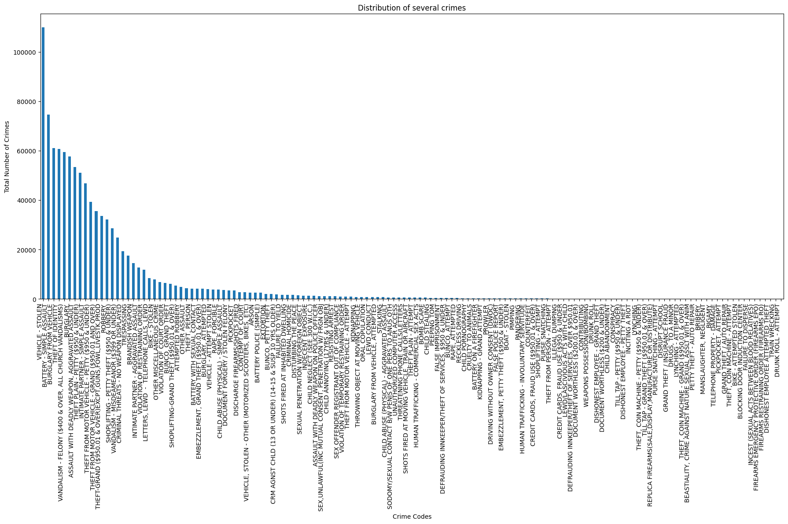
    


```python

```

iii. (10pts) Make a visualization to suggest highest crime prone areas. You may plot
multiple graphs


```python
area_crime_counts = df['AREA NAME'].value_counts()
plt.figure(figsize=(10,6))
area_crime_counts.plot(kind='bar', color='coral')
plt.title('Crime prone areas distribution')
plt.xlabel('Crime areas')
plt.ylabel('Number of Crimes')
plt.xticks(rotation=45)
plt.show()
```


    
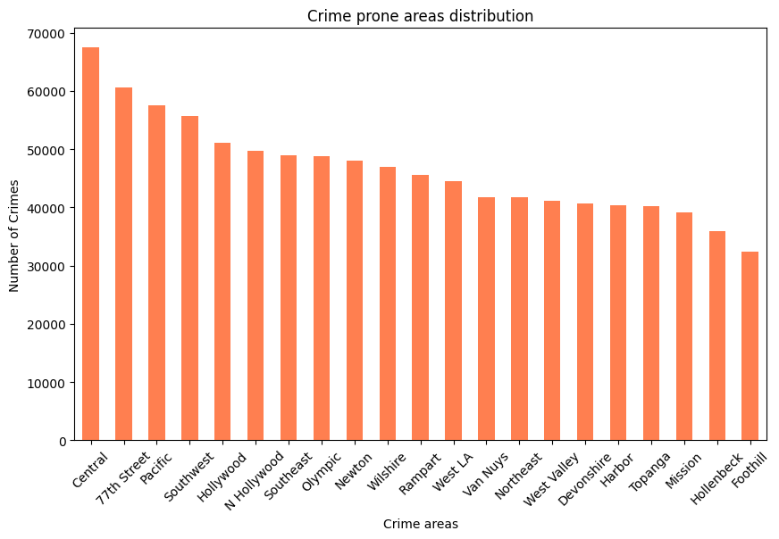
    


```python
import matplotlib.pyplot as plt

count_by_area = df['AREA NAME'].value_counts()
plt.figure(figsize=(12, 6))
plt.pie(count_by_area, labels=count_by_area.index, autopct='%1.1f%%', startangle=140)
plt.title('Crime Prone Areas Distribution')
plt.axis('equal') 
plt.tight_layout()
plt.show()

```


    
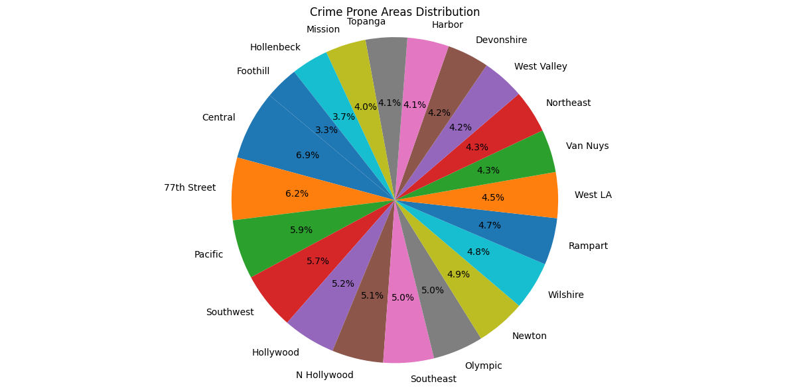
    


iv. (10pts) Make a visualization to warn general public about the trend crimes
according to the time of crime occurence, sex and age of victim and the area in
which it can occur. You may plot multiple graphs.


```python
# Time of Occurrence vs Crimes
df['Hour_of_Crime'] = df['TIME OCC'] // 100  # Converting time to hours
crime_by_hour = df.groupby('Hour_of_Crime').size()

plt.figure(figsize=(10, 6))
crime_by_hour.plot(kind='line', color='purple')
plt.title('Crimes of Occurrence by Hour')
plt.xlabel('Hour')
plt.ylabel('Number of Crimes')
plt.grid(True)
plt.show()
```


    
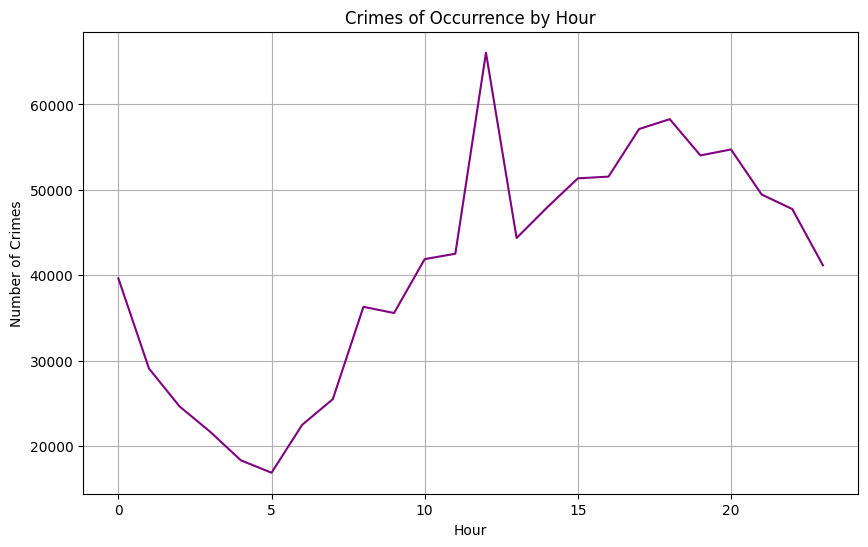
    


```python
# Histogram with time
plt.figure(figsize=(10,6))
df['TIME OCC'].hist(bins=24, color='lightgreen')
plt.title('Crime Occurrences by Time of Day')
plt.xlabel('Time of Occurrence')
plt.ylabel('Number of Crimes')
plt.show()
```


    
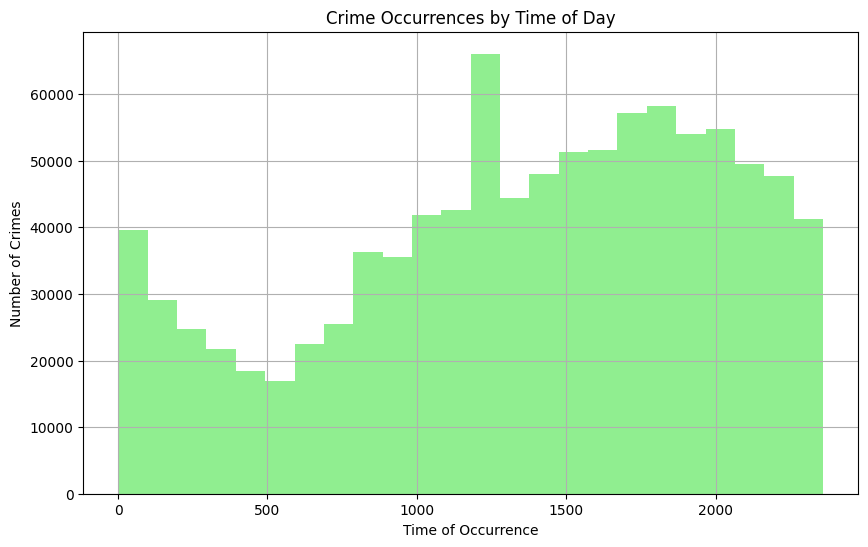
    


`The histograms showed that crimes occurred more frequently after 10 and peaked at 12`


```python
# Crimes by Victim's Sex
sex_counts = df['Vict Sex'].value_counts()
plt.figure(figsize=(6, 6))
sex_counts.plot(kind='pie', autopct='%1.1f%%', colors=['yellow', 'red' , 'lightblue', 'orange'], startangle=90)
plt.title("Crimes on Victim's Sex")
plt.ylabel('')
plt.show()
```


    
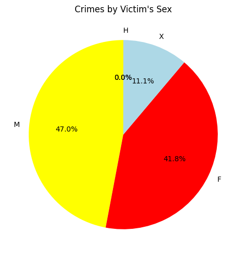
    


`The pie charts showed that crimes occurred more frequently on males`


```python
df['Victim_Age_Group'] = pd.cut(df['Vict Age'], bins=[0, 18, 30, 45, 60, 100], labels=['0-18', '19-30', '31-45', '46-60', '61+'])
age_group_counts = df['Victim_Age_Group'].value_counts().sort_index()

plt.figure(figsize=(10, 6))
age_group_counts.plot(kind='bar', color='orange')
plt.title('Crimes on Victim Age Group')
plt.xlabel('Age Group')
plt.ylabel('Number of Crimes')
plt.show()
```


    
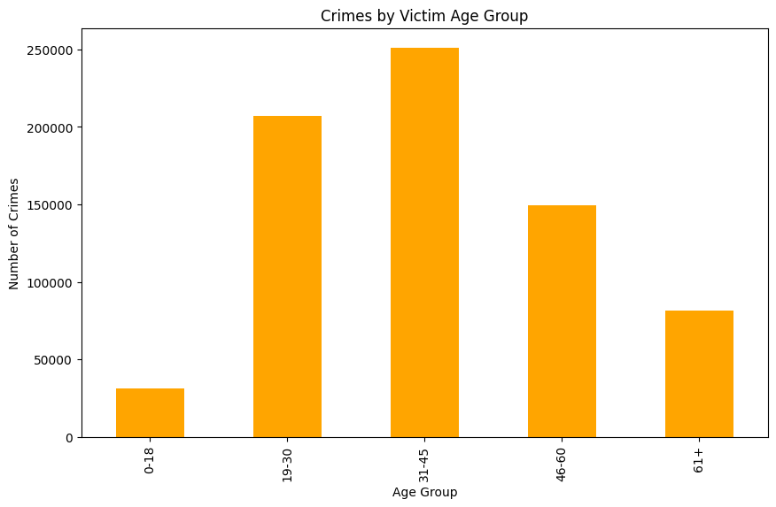
    


The bar graph showed that crimes occurred more frequently on 31-45 age groups


```python
#bar plot
crimearea_cnt = df['AREA NAME'].value_counts()
crimearea_cnt
plt.figure(figsize=(1, 6))
crimearea_cnt.plot(kind='bar')
plt.title('Distribution of several crimes')
plt.xlabel('Crime Areas')
plt.ylabel('Total Number of Crimes')
plt.xticks(rotation=90, ha='right')
plt.tight_layout()

plt.show()
```


    
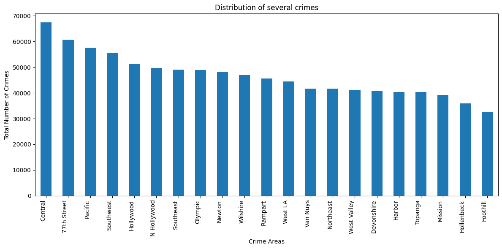
    


`The bar chart showed that crimes occurred more frequently at central, 77th Street`


```python
print(df['Crm Cd Desc'].unique() )
```

    ['VEHICLE - STOLEN' 'BURGLARY FROM VEHICLE' 'BIKE - STOLEN'
     'SHOPLIFTING-GRAND THEFT ($950.01 & OVER)' 'THEFT OF IDENTITY'
     'BATTERY - SIMPLE ASSAULT'
     'SODOMY/SEXUAL CONTACT B/W PENIS OF ONE PERS TO ANUS OTH'
     'CRM AGNST CHLD (13 OR UNDER) (14-15 & SUSP 10 YRS OLDER)'
     'ASSAULT WITH DEADLY WEAPON, AGGRAVATED ASSAULT'
     'LETTERS, LEWD  -  TELEPHONE CALLS, LEWD'
     'THEFT-GRAND ($950.01 & OVER)EXCPT,GUNS,FOWL,LIVESTK,PROD'
     'CRIMINAL THREATS - NO WEAPON DISPLAYED'
     'EMBEZZLEMENT, GRAND THEFT ($950.01 & OVER)'
     'THEFT FROM MOTOR VEHICLE - PETTY ($950 & UNDER)'
     'CHILD ANNOYING (17YRS & UNDER)' 'THEFT PLAIN - PETTY ($950 & UNDER)'
     'INTIMATE PARTNER - SIMPLE ASSAULT' 'LEWD CONDUCT'
     'THEFT PLAIN - ATTEMPT' 'BURGLARY'
     'THEFT FROM MOTOR VEHICLE - GRAND ($950.01 AND OVER)' 'ROBBERY'
     'BUNCO, GRAND THEFT' 'BATTERY WITH SEXUAL CONTACT'
     'INTIMATE PARTNER - AGGRAVATED ASSAULT' 'ORAL COPULATION'
     'UNAUTHORIZED COMPUTER ACCESS'
     'SEX,UNLAWFUL(INC MUTUAL CONSENT, PENETRATION W/ FRGN OBJ'
     'VIOLATION OF RESTRAINING ORDER'
     'SHOPLIFTING - PETTY THEFT ($950 & UNDER)'
     'VANDALISM - FELONY ($400 & OVER, ALL CHURCH VANDALISMS)'
     'OTHER MISCELLANEOUS CRIME' 'BRANDISH WEAPON'
     'DOCUMENT FORGERY / STOLEN FELONY'
     'SEX OFFENDER REGISTRANT OUT OF COMPLIANCE' 'RAPE, FORCIBLE'
     'VANDALISM - MISDEAMEANOR ($399 OR UNDER)'
     'CHILD ABUSE (PHYSICAL) - SIMPLE ASSAULT'
     'CREDIT CARDS, FRAUD USE ($950.01 & OVER)'
     'THREATENING PHONE CALLS/LETTERS' 'SEXUAL PENETRATION W/FOREIGN OBJECT'
     'EXTORTION' 'OTHER ASSAULT' 'PICKPOCKET' 'ARSON' 'DISTURBING THE PEACE'
     'BUNCO, ATTEMPT' 'HUMAN TRAFFICKING - INVOLUNTARY SERVITUDE' 'PIMPING'
     'PEEPING TOM' 'VIOLATION OF COURT ORDER' 'CONTEMPT OF COURT'
     'FALSE POLICE REPORT' 'CONTRIBUTING' 'FALSE IMPRISONMENT'
     'CHILD ABUSE (PHYSICAL) - AGGRAVATED ASSAULT' 'ATTEMPTED ROBBERY'
     'CREDIT CARDS, FRAUD USE ($950 & UNDER' 'CHILD STEALING'
     'LEWD/LASCIVIOUS ACTS WITH CHILD'
     'EMBEZZLEMENT, PETTY THEFT ($950 & UNDER)' 'INDECENT EXPOSURE'
     'CHILD NEGLECT (SEE 300 W.I.C.)' 'STALKING'
     'DISHONEST EMPLOYEE - GRAND THEFT' 'TRESPASSING' 'BURGLARY, ATTEMPTED'
     'RAPE, ATTEMPTED' 'DISCHARGE FIREARMS/SHOTS FIRED'
     'HUMAN TRAFFICKING - COMMERCIAL SEX ACTS' 'VEHICLE - ATTEMPT STOLEN'
     'PANDERING' 'FIREARMS RESTRAINING ORDER (FIREARMS RO)' 'RESISTING ARREST'
     'BURGLARY FROM VEHICLE, ATTEMPTED' 'THEFT, PERSON'
     'BATTERY POLICE (SIMPLE)'
     'VEHICLE, STOLEN - OTHER (MOTORIZED SCOOTERS, BIKES, ETC)'
     'THEFT FROM PERSON - ATTEMPT' 'FAILURE TO YIELD' 'BOMB SCARE'
     'ASSAULT WITH DEADLY WEAPON ON POLICE OFFICER' 'BUNCO, PETTY THEFT'
     'SHOTS FIRED AT INHABITED DWELLING'
     'DEFRAUDING INNKEEPER/THEFT OF SERVICES, $950 & UNDER'
     'KIDNAPPING - GRAND ATTEMPT'
     'SHOTS FIRED AT MOVING VEHICLE, TRAIN OR AIRCRAFT'
     'TILL TAP - GRAND THEFT ($950.01 & OVER)'
     'VIOLATION OF TEMPORARY RESTRAINING ORDER'
     'THROWING OBJECT AT MOVING VEHICLE' 'DOCUMENT WORTHLESS ($200.01 & OVER)'
     'KIDNAPPING' 'CRIMINAL HOMICIDE' 'PURSE SNATCHING'
     'THEFT FROM MOTOR VEHICLE - ATTEMPT' 'DISHONEST EMPLOYEE - PETTY THEFT'
     'CHILD PORNOGRAPHY' 'WEAPONS POSSESSION/BOMBING'
     'DRIVING WITHOUT OWNER CONSENT (DWOC)'
     'REPLICA FIREARMS(SALE,DISPLAY,MANUFACTURE OR DISTRIBUTE)' 'LYNCHING'
     'RECKLESS DRIVING' 'SHOPLIFTING - ATTEMPT' 'COUNTERFEIT'
     'DEFRAUDING INNKEEPER/THEFT OF SERVICES, OVER $950.01'
     'BATTERY ON A FIREFIGHTER' 'CRUELTY TO ANIMALS' 'BOAT - STOLEN'
     'ILLEGAL DUMPING' 'PROWLER' 'DRUGS, TO A MINOR'
     'THEFT, COIN MACHINE - PETTY ($950 & UNDER)'
     'DOCUMENT WORTHLESS ($200 & UNDER)' 'MANSLAUGHTER, NEGLIGENT'
     'PETTY THEFT - AUTO REPAIR' 'THEFT, COIN MACHINE - ATTEMPT'
     'TILL TAP - PETTY ($950 & UNDER)' 'PURSE SNATCHING - ATTEMPT'
     'LYNCHING - ATTEMPTED' 'BIKE - ATTEMPTED STOLEN' 'CONSPIRACY'
     'GRAND THEFT / AUTO REPAIR' 'BRIBERY' 'GRAND THEFT / INSURANCE FRAUD'
     'DRUNK ROLL' 'CHILD ABANDONMENT'
     'THEFT, COIN MACHINE - GRAND ($950.01 & OVER)' 'DISRUPT SCHOOL'
     'PICKPOCKET, ATTEMPT' 'TELEPHONE PROPERTY - DAMAGE'
     'BEASTIALITY, CRIME AGAINST NATURE SEXUAL ASSLT WITH ANIM' 'BIGAMY'
     'FAILURE TO DISPERSE'
     'FIREARMS EMERGENCY PROTECTIVE ORDER (FIREARMS EPO)'
     'INCEST (SEXUAL ACTS BETWEEN BLOOD RELATIVES)'
     'BLOCKING DOOR INDUCTION CENTER' 'INCITING A RIOT'
     'DISHONEST EMPLOYEE ATTEMPTED THEFT' 'TRAIN WRECKING'
     'DRUNK ROLL - ATTEMPT']
    


```python

```

## ***c. Investigating Patterns of Vehicle Thefts in Los Angeles:***


i. Apply conditions to make it a valid problem statement. Also provide features which you think are important according to your problem statement.


`The goal here is to focus on vehicle theft crimes, so I filtered the dataset for rows where the crime description (crm_cd_desc) matches specific vehicle-related offenses such as "VEHICLE - STOLEN", "BURGLARY FROM VEHICLE", and "VEHICLE - ATTEMPT STOLEN".`

**Features I chose:**
- `area_name`, `lat`, `lon` for understanding the location of thefts.
- `time_occ` for analyzing the time of theft.
- `vict_age` and `vict_sex` to see how demographic factors may affect vehicle theft.


```python
vehicle_theft_df = df[df['Crm Cd Desc'].isin([
    'VEHICLE - STOLEN', 'BURGLARY FROM VEHICLE', 'VEHICLE - ATTEMPT STOLEN'])]
vehicle_theft_df
```


<div>
<style scoped>
    .dataframe tbody tr th:only-of-type {
        vertical-align: middle;
    }

    .dataframe tbody tr th {
        vertical-align: top;
    }

    .dataframe thead th {
        text-align: right;
    }
</style>
<table border="1" class="dataframe">
  <thead>
    <tr style="text-align: right;">
      <th></th>
      <th>DR_NO</th>
      <th>Date Rptd</th>
      <th>DATE OCC</th>
      <th>TIME OCC</th>
      <th>AREA</th>
      <th>AREA NAME</th>
      <th>Rpt Dist No</th>
      <th>Part 1-2</th>
      <th>Crm Cd</th>
      <th>Crm Cd Desc</th>
      <th>...</th>
      <th>Crm Cd 1</th>
      <th>Crm Cd 2</th>
      <th>Crm Cd 3</th>
      <th>Crm Cd 4</th>
      <th>LOCATION</th>
      <th>Cross Street</th>
      <th>LAT</th>
      <th>LON</th>
      <th>Hour_of_Crime</th>
      <th>Victim_Age_Group</th>
    </tr>
  </thead>
  <tbody>
    <tr>
      <th>0</th>
      <td>190326475</td>
      <td>03/01/2020 12:00:00 AM</td>
      <td>03/01/2020 12:00:00 AM</td>
      <td>2130</td>
      <td>7</td>
      <td>Wilshire</td>
      <td>784</td>
      <td>1</td>
      <td>510</td>
      <td>VEHICLE - STOLEN</td>
      <td>...</td>
      <td>510.0</td>
      <td>998.0</td>
      <td>NaN</td>
      <td>NaN</td>
      <td>1900 S  LONGWOOD                     AV</td>
      <td>NaN</td>
      <td>34.0375</td>
      <td>-118.3506</td>
      <td>21</td>
      <td>NaN</td>
    </tr>
    <tr>
      <th>1</th>
      <td>200106753</td>
      <td>02/09/2020 12:00:00 AM</td>
      <td>02/08/2020 12:00:00 AM</td>
      <td>1800</td>
      <td>1</td>
      <td>Central</td>
      <td>182</td>
      <td>1</td>
      <td>330</td>
      <td>BURGLARY FROM VEHICLE</td>
      <td>...</td>
      <td>330.0</td>
      <td>998.0</td>
      <td>NaN</td>
      <td>NaN</td>
      <td>1000 S  FLOWER                       ST</td>
      <td>NaN</td>
      <td>34.0444</td>
      <td>-118.2628</td>
      <td>18</td>
      <td>46-60</td>
    </tr>
    <tr>
      <th>13</th>
      <td>221008844</td>
      <td>05/06/2022 12:00:00 AM</td>
      <td>11/01/2020 12:00:00 AM</td>
      <td>130</td>
      <td>10</td>
      <td>West Valley</td>
      <td>1029</td>
      <td>1</td>
      <td>510</td>
      <td>VEHICLE - STOLEN</td>
      <td>...</td>
      <td>510.0</td>
      <td>NaN</td>
      <td>NaN</td>
      <td>NaN</td>
      <td>VALJEAN                      ST</td>
      <td>VANOWEN                      AV</td>
      <td>34.1939</td>
      <td>-118.4859</td>
      <td>1</td>
      <td>NaN</td>
    </tr>
    <tr>
      <th>23</th>
      <td>200412582</td>
      <td>09/09/2020 12:00:00 AM</td>
      <td>09/09/2020 12:00:00 AM</td>
      <td>630</td>
      <td>4</td>
      <td>Hollenbeck</td>
      <td>413</td>
      <td>1</td>
      <td>510</td>
      <td>VEHICLE - STOLEN</td>
      <td>...</td>
      <td>510.0</td>
      <td>NaN</td>
      <td>NaN</td>
      <td>NaN</td>
      <td>200 E  AVENUE 28</td>
      <td>NaN</td>
      <td>34.0820</td>
      <td>-118.2130</td>
      <td>6</td>
      <td>NaN</td>
    </tr>
    <tr>
      <th>27</th>
      <td>200209713</td>
      <td>05/03/2020 12:00:00 AM</td>
      <td>05/02/2020 12:00:00 AM</td>
      <td>1800</td>
      <td>2</td>
      <td>Rampart</td>
      <td>245</td>
      <td>1</td>
      <td>510</td>
      <td>VEHICLE - STOLEN</td>
      <td>...</td>
      <td>510.0</td>
      <td>NaN</td>
      <td>NaN</td>
      <td>NaN</td>
      <td>2500 W  4TH                          ST</td>
      <td>NaN</td>
      <td>34.0642</td>
      <td>-118.2771</td>
      <td>18</td>
      <td>NaN</td>
    </tr>
    <tr>
      <th>...</th>
      <td>...</td>
      <td>...</td>
      <td>...</td>
      <td>...</td>
      <td>...</td>
      <td>...</td>
      <td>...</td>
      <td>...</td>
      <td>...</td>
      <td>...</td>
      <td>...</td>
      <td>...</td>
      <td>...</td>
      <td>...</td>
      <td>...</td>
      <td>...</td>
      <td>...</td>
      <td>...</td>
      <td>...</td>
      <td>...</td>
      <td>...</td>
    </tr>
    <tr>
      <th>978607</th>
      <td>241304056</td>
      <td>01/02/2024 12:00:00 AM</td>
      <td>01/01/2024 12:00:00 AM</td>
      <td>2100</td>
      <td>13</td>
      <td>Newton</td>
      <td>1347</td>
      <td>1</td>
      <td>510</td>
      <td>VEHICLE - STOLEN</td>
      <td>...</td>
      <td>510.0</td>
      <td>NaN</td>
      <td>NaN</td>
      <td>NaN</td>
      <td>41ST</td>
      <td>LONG BEACH</td>
      <td>34.0072</td>
      <td>-118.2432</td>
      <td>21</td>
      <td>NaN</td>
    </tr>
    <tr>
      <th>978611</th>
      <td>241406728</td>
      <td>02/29/2024 12:00:00 AM</td>
      <td>02/28/2024 12:00:00 AM</td>
      <td>100</td>
      <td>14</td>
      <td>Pacific</td>
      <td>1415</td>
      <td>1</td>
      <td>510</td>
      <td>VEHICLE - STOLEN</td>
      <td>...</td>
      <td>510.0</td>
      <td>NaN</td>
      <td>NaN</td>
      <td>NaN</td>
      <td>1300    APPLETON                     WY</td>
      <td>NaN</td>
      <td>34.0038</td>
      <td>-118.4553</td>
      <td>1</td>
      <td>NaN</td>
    </tr>
    <tr>
      <th>978616</th>
      <td>240905054</td>
      <td>01/31/2024 12:00:00 AM</td>
      <td>01/30/2024 12:00:00 AM</td>
      <td>2230</td>
      <td>9</td>
      <td>Van Nuys</td>
      <td>901</td>
      <td>1</td>
      <td>330</td>
      <td>BURGLARY FROM VEHICLE</td>
      <td>...</td>
      <td>330.0</td>
      <td>NaN</td>
      <td>NaN</td>
      <td>NaN</td>
      <td>15300    SHERMAN                      WY</td>
      <td>NaN</td>
      <td>34.2012</td>
      <td>-118.4725</td>
      <td>22</td>
      <td>31-45</td>
    </tr>
    <tr>
      <th>978623</th>
      <td>240710284</td>
      <td>07/24/2024 12:00:00 AM</td>
      <td>07/23/2024 12:00:00 AM</td>
      <td>1400</td>
      <td>7</td>
      <td>Wilshire</td>
      <td>788</td>
      <td>1</td>
      <td>510</td>
      <td>VEHICLE - STOLEN</td>
      <td>...</td>
      <td>510.0</td>
      <td>NaN</td>
      <td>NaN</td>
      <td>NaN</td>
      <td>4000 W  23RD                         ST</td>
      <td>NaN</td>
      <td>34.0362</td>
      <td>-118.3284</td>
      <td>14</td>
      <td>NaN</td>
    </tr>
    <tr>
      <th>978627</th>
      <td>240910892</td>
      <td>08/13/2024 12:00:00 AM</td>
      <td>08/12/2024 12:00:00 AM</td>
      <td>2300</td>
      <td>9</td>
      <td>Van Nuys</td>
      <td>914</td>
      <td>1</td>
      <td>510</td>
      <td>VEHICLE - STOLEN</td>
      <td>...</td>
      <td>510.0</td>
      <td>NaN</td>
      <td>NaN</td>
      <td>NaN</td>
      <td>6900    VESPER                       AV</td>
      <td>NaN</td>
      <td>34.1961</td>
      <td>-118.4510</td>
      <td>23</td>
      <td>NaN</td>
    </tr>
  </tbody>
</table>
<p>174763 rows × 30 columns</p>
</div>


```python
vehicle_theft_df.head()
```


<div>
<style scoped>
    .dataframe tbody tr th:only-of-type {
        vertical-align: middle;
    }

    .dataframe tbody tr th {
        vertical-align: top;
    }

    .dataframe thead th {
        text-align: right;
    }
</style>
<table border="1" class="dataframe">
  <thead>
    <tr style="text-align: right;">
      <th></th>
      <th>DR_NO</th>
      <th>Date Rptd</th>
      <th>DATE OCC</th>
      <th>TIME OCC</th>
      <th>AREA</th>
      <th>AREA NAME</th>
      <th>Rpt Dist No</th>
      <th>Part 1-2</th>
      <th>Crm Cd</th>
      <th>Crm Cd Desc</th>
      <th>...</th>
      <th>Crm Cd 1</th>
      <th>Crm Cd 2</th>
      <th>Crm Cd 3</th>
      <th>Crm Cd 4</th>
      <th>LOCATION</th>
      <th>Cross Street</th>
      <th>LAT</th>
      <th>LON</th>
      <th>Hour_of_Crime</th>
      <th>Victim_Age_Group</th>
    </tr>
  </thead>
  <tbody>
    <tr>
      <th>0</th>
      <td>190326475</td>
      <td>03/01/2020 12:00:00 AM</td>
      <td>03/01/2020 12:00:00 AM</td>
      <td>2130</td>
      <td>7</td>
      <td>Wilshire</td>
      <td>784</td>
      <td>1</td>
      <td>510</td>
      <td>VEHICLE - STOLEN</td>
      <td>...</td>
      <td>510.0</td>
      <td>998.0</td>
      <td>NaN</td>
      <td>NaN</td>
      <td>1900 S  LONGWOOD                     AV</td>
      <td>NaN</td>
      <td>34.0375</td>
      <td>-118.3506</td>
      <td>21</td>
      <td>NaN</td>
    </tr>
    <tr>
      <th>1</th>
      <td>200106753</td>
      <td>02/09/2020 12:00:00 AM</td>
      <td>02/08/2020 12:00:00 AM</td>
      <td>1800</td>
      <td>1</td>
      <td>Central</td>
      <td>182</td>
      <td>1</td>
      <td>330</td>
      <td>BURGLARY FROM VEHICLE</td>
      <td>...</td>
      <td>330.0</td>
      <td>998.0</td>
      <td>NaN</td>
      <td>NaN</td>
      <td>1000 S  FLOWER                       ST</td>
      <td>NaN</td>
      <td>34.0444</td>
      <td>-118.2628</td>
      <td>18</td>
      <td>46-60</td>
    </tr>
    <tr>
      <th>13</th>
      <td>221008844</td>
      <td>05/06/2022 12:00:00 AM</td>
      <td>11/01/2020 12:00:00 AM</td>
      <td>130</td>
      <td>10</td>
      <td>West Valley</td>
      <td>1029</td>
      <td>1</td>
      <td>510</td>
      <td>VEHICLE - STOLEN</td>
      <td>...</td>
      <td>510.0</td>
      <td>NaN</td>
      <td>NaN</td>
      <td>NaN</td>
      <td>VALJEAN                      ST</td>
      <td>VANOWEN                      AV</td>
      <td>34.1939</td>
      <td>-118.4859</td>
      <td>1</td>
      <td>NaN</td>
    </tr>
    <tr>
      <th>23</th>
      <td>200412582</td>
      <td>09/09/2020 12:00:00 AM</td>
      <td>09/09/2020 12:00:00 AM</td>
      <td>630</td>
      <td>4</td>
      <td>Hollenbeck</td>
      <td>413</td>
      <td>1</td>
      <td>510</td>
      <td>VEHICLE - STOLEN</td>
      <td>...</td>
      <td>510.0</td>
      <td>NaN</td>
      <td>NaN</td>
      <td>NaN</td>
      <td>200 E  AVENUE 28</td>
      <td>NaN</td>
      <td>34.0820</td>
      <td>-118.2130</td>
      <td>6</td>
      <td>NaN</td>
    </tr>
    <tr>
      <th>27</th>
      <td>200209713</td>
      <td>05/03/2020 12:00:00 AM</td>
      <td>05/02/2020 12:00:00 AM</td>
      <td>1800</td>
      <td>2</td>
      <td>Rampart</td>
      <td>245</td>
      <td>1</td>
      <td>510</td>
      <td>VEHICLE - STOLEN</td>
      <td>...</td>
      <td>510.0</td>
      <td>NaN</td>
      <td>NaN</td>
      <td>NaN</td>
      <td>2500 W  4TH                          ST</td>
      <td>NaN</td>
      <td>34.0642</td>
      <td>-118.2771</td>
      <td>18</td>
      <td>NaN</td>
    </tr>
  </tbody>
</table>
<p>5 rows × 30 columns</p>
</div>


`I identified vehicle theft patterns by filtering the dataset where the crm_cd_desc (crime description) matches vehicle-related crimes. By ensuring that the analysis focused purely on crimes like "VEHICLE - STOLEN" and "BURGLARY FROM VEHICLE." `

`Important features include time of crime, area, and victim .`

ii. (10 pts) Explain your approach to your problem statement.


iii. (10 pts) Perform data cleaning to get the pure data for this problem. Explain your data cleaning steps.( At least 3 cleaning steps)


```python
# Check for missing values
print(df.isnull().sum())
```


```python
# Check for duplicates
print(df.duplicated().sum())
```


```python

```

iv. (10 pts) Implement your approach to this problem and justify your hypothesis


```python

```


```python
vehicle_theft_data = df[df['Crm Cd Desc'].str.contains("VEHICLE", case=False, na=False)]

```


```python
vehicle_theft_data = vehicle_theft_data.dropna(subset=['LAT', 'LON'])
```


```python
vehicle_theft_data['TIME OCC'] = vehicle_theft_data['TIME OCC'].apply(lambda x: f'{int(x):04d}')

```


```python
vehicle_theft_data = vehicle_theft_data.drop_duplicates()

```


```python
vehicle_theft_data = vehicle_theft_data.dropna(subset=['Vict Age', 'Vict Sex'])

```


```python
# iii. Geographic Hotspots
plt.scatter(vehicle_theft_data['LON'], vehicle_theft_data['LAT'], alpha=0.5, c='red', s=10)
plt.title('Geographic Distribution of Vehicle Thefts in LA')
plt.xlabel('Longitude')
plt.ylabel('Latitude')
plt.show()
```


    
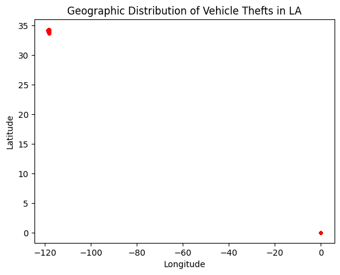
    


```python
vehicle_theft_data['hour'] = vehicle_theft_data['TIME OCC'].str[:2].astype(int)

```


```python
import matplotlib.pyplot as plt

plt.scatter(vehicle_theft_data['lon'], vehicle_theft_data['lat'], alpha=0.5, c='red', s=10)
plt.title('Geographic Distribution of Vehicle Thefts in LA')
plt.xlabel('Longitude')
plt.ylabel('Latitude')
plt.show()

```


```python
hourly_thefts = vehicle_theft_data.groupby('hour').size()

plt.plot(hourly_thefts.index, hourly_thefts.values, marker='o')
plt.title('Vehicle Thefts by Hour of Day')
plt.xlabel('Hour of Day (24-hour format)')
plt.ylabel('Number of Thefts')
plt.xticks(range(0, 24))
plt.grid(True)
plt.show()

```


    
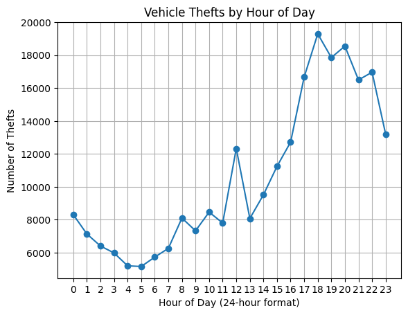
    


```python

```


```python
# iii. Victim Age Distribution for Identity Theft
vehicle_theft_data['Vict Age'].plot(kind='hist', bins=20, color='orange')
plt.title('Distribution of Identity Theft Victims by Age')
plt.xlabel('Age')
plt.show()

# iv. Victim Sex Distribution for Identity Theft
vehicle_theft_data['Vict Sex'].value_counts().plot(kind='bar', color='purple')
plt.title('Distribution of Identity Theft Victims by Sex')
plt.xlabel('Sex')
plt.ylabel('Count')
plt.show()
```


    
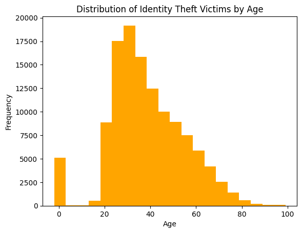
    


    
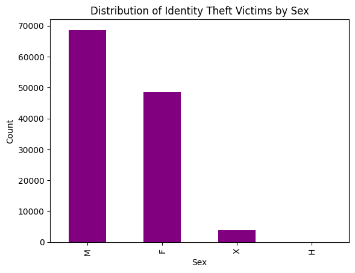
    


```python

```


```python

```

# d. Exploring Identity Theft Cases in Los Angeles

i. (10 pts) Explain your approach to this problem. Also provide features which you
think are important according to your problem statement.


```python

```


```python

```


```python

```

ii. (10 pts) Perform data cleaning to get the pure data for this problem. Explain your data cleaning steps.


```python

```


```python

```


```python

```
